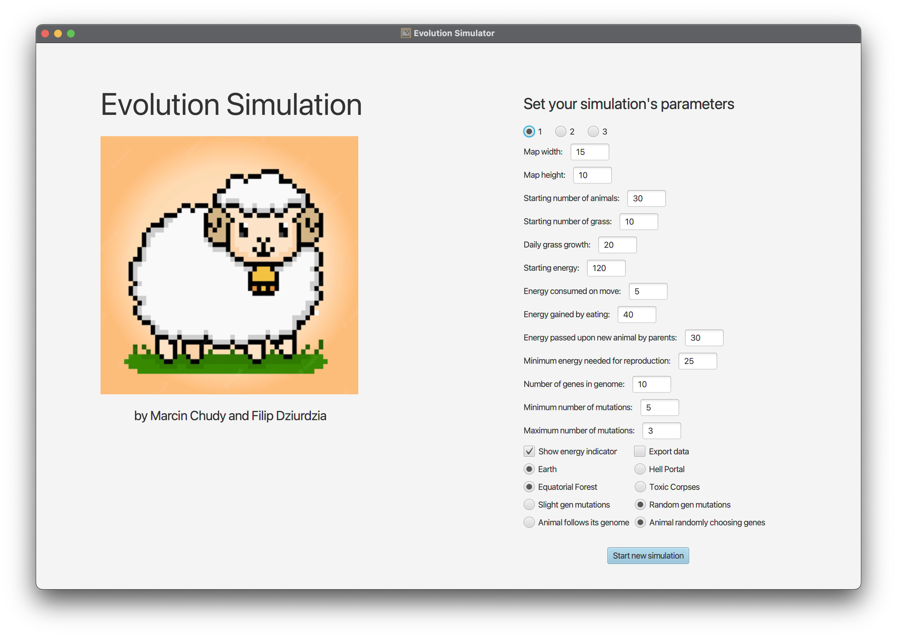
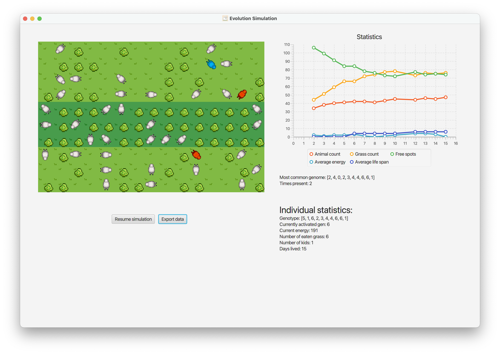

# Life Simulation

Project was developed as an assignment for the Object Oriented Programming course as AGH UST 2022/23. It is a result of cooperation with [Amazagni](https://github.com/Amazagni) and the process od development can be found [here](https://github.com/Amazagni/PO_Projekt1).

To run the app open project folder in terminal and type following lines

```
$ ./gradlew build
$ ./gradlew run
```

Or alternatively open project in IDE e.g. IntelliJ and run `World` class.



Main page of the application allows you to change the simulation parameters or choose one of the three prepared configurations.

Starting new application opens new window, where you can see the graphic interpretation of the ongoing simiulation with charts displaying most important data. Multiple simulations can be run simultaneously.



You can pause the simulation and click on the animal you would like to see individual statistics of. It will be highlighted as blue. Red animals are the ones with dominant genome.

## Further Documentation

### Animals

Every animal can be expressed as a list of genes, that imply the way of them moving on the map. Every gene is a number from the range of `0-7`, which represent 8 directions animal can go e.g. north, south-west etc.

Additionally, they contain a set od statistics listed below
* Position
* Direction facing
* Current energy
* Index of the last gen that implied movement
* Birth day
* Age
* Number of grass eaten
* Number of children

### Map

Map is grid `Map width x Map height` of fields on which animals can move and grass grow. Our simulation consist 4 variations of maps to choose from, more about them below.

### Simulation Rules

Simulation runs on few basics rules
* Everyday animals lose `Energy consumed on move` energy points
* Upon standing on the field with grass, animal eats it gaining `Energy gained by eating` energy points
* When multiple animals stand on the same grass the strongest (with most energy points) eats
* When animals meet on the same field and both have more than `Minimum energy needed for reproduction` energy points, they both give `Energy passed upon new animal by parents` energy points as his starting energy
* New animal's genotype is created from parents' genotypes in proportion of their energy e.g. parents have 50 and 150 energy points, so the child's genotype consists 25% and 75% of corresponding genotypes. Then, random number from range [`Minimum number of mutations`, `Maximum number of mutations`] of genes mutates.

### Simulation variations
Our simulation has couple variations to choose from. 

1. Map boundaries
    * **Earth** - left and right boundaries are in loop (if animal goes out on the left he shows up on the right), but they can't go through top and bottom boundaries (they will stay and be rotated)
    *  **Hell Portal** - animal stepping out of the map will lose `Energy passed upon new animal by parents` energy points and will be teleported to the random place on the map
  
2. Grass growth
   * **Equatorial Forest** - horiztonal lane consisting of 20% of the fields will be favored - 80% chances that grass will grow there
   *  **Toxic Corpses** - fields with the least count of the dead animals will be favored by the grass

3. Mutations
   * **Slight gen mutations** - Gen goes 1 up or down e.g. 4 can change into 3 or 5
   * **Random gen mutations** - Gen completely randomises

4. Animal Behaviour
   * **Animal follows its genome** - Animal follows genotype in the correct order
   * **Animal randomly chooses genes** - Animal chooses gen to execute completely randomly
